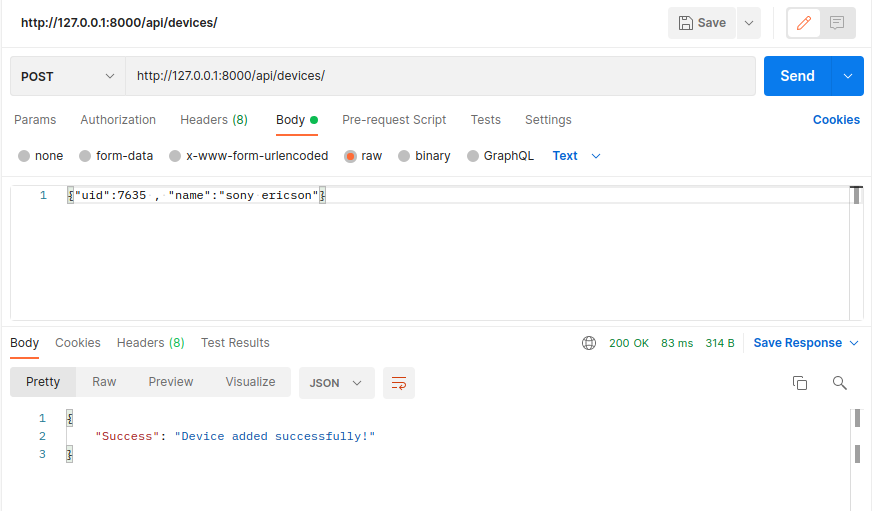
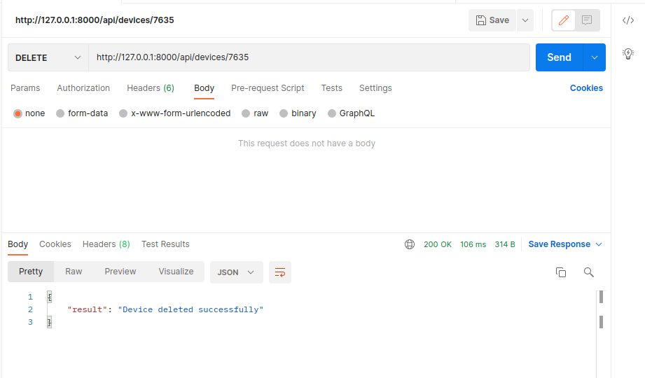
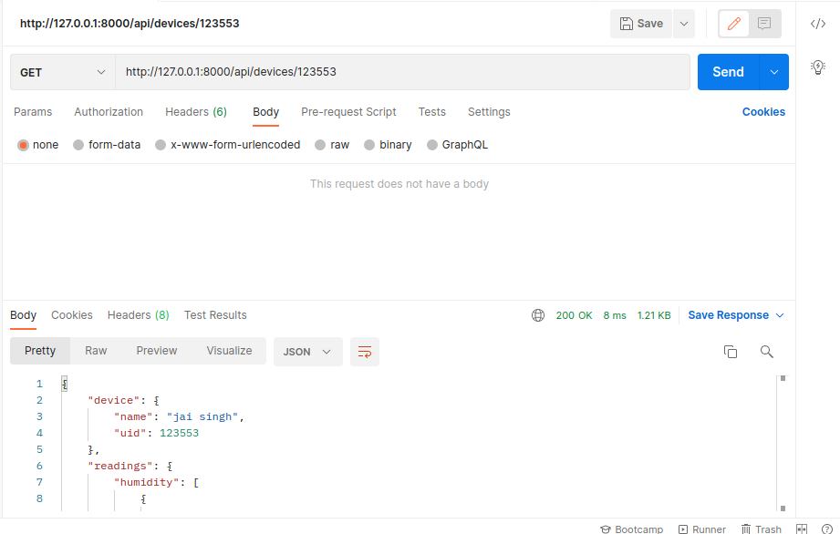
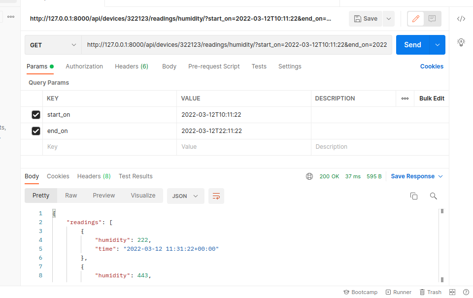
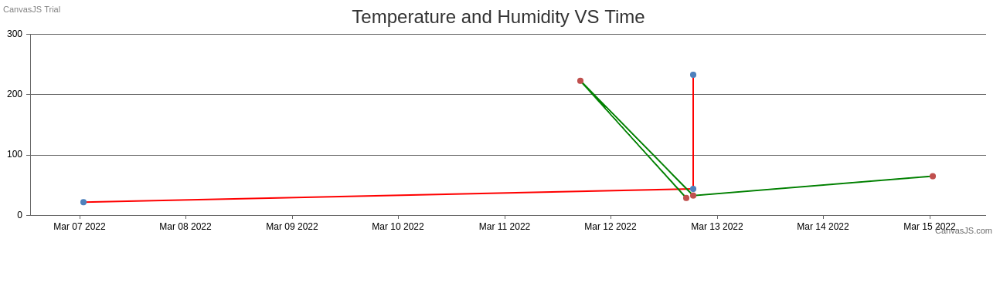

# Django Backend Application
Assignment link - 
https://drive.google.com/file/d/1xe-BzlkleaQAvGPr-_qldDLfv_xcNT8w/view?usp=sharing

## API to create a device
<ul>
<li>Endpoint: POST /api/devices/</li>
<li> Content-Type: application/json</li>
<li> Request Payload</li>
<ul>
<li> uid</li>
<li> name</li>
</ul>
</ul>

## API to delete a device
<ul>
<li>Endpoint: DELETE /api/devices/{device-uid}</li>
<ul>
<li>
 device-uid - uid of the device you want to delete
</li>
</ul>
</ul>

## API to retrieve a device
<ul>
<li>Endpoint: GET /api/devices/{device-uid}</li>
<ul>
<li>
device-uid - uid of the device you want to retrieve
</li>
</ul>
</ul>

## JSON Response of device data - api/devices/uid
`
{
    "device": {
        "name": "jai singh",
        "uid": 123553
    },
    "readings": {
        "humidity": [
            {
                "humidity": 29,
                "time": "2022-03-12 11:34:52+00:00"
            },
            {
                "humidity": 223,
                "time": "2022-03-11 11:35:10+00:00"
            },
            {
                "humidity": 33,
                "time": "2022-03-12 13:06:52+00:00"
            },
            {
                "humidity": 65,
                "time": "2022-03-14 19:20:05+00:00"
            }
        ],
        "temperature": [
            {
                "temperature": 233,
                "time": "2022-03-12 13:06:52+00:00"
            },
            {
                "temperature": 44,
                "time": "2022-03-12 13:06:52+00:00"
            },
            {
                "temperature": 22,
                "time": "2022-03-06 19:21:16+00:00"
            }
        ]
    }
}
`

## API to list all devices
<ul>
<li>Endpoint: GET /api/devices/</li>
<li>Response format should be JSON</li>
</ul>

## JSON Response of -  api/devices/

`
{
    "devices": [
        {
            "uid": 123553,
            "name": "jai singh"
        },
        {
            "uid": 211345,
            "name": "love"
        },
        {
            "uid": 322123,
            "name": "raju"
        }
    ]
}
`

## API to return readings for the given device in a given period.

<ul>
<li>
Endpoint: GET /api/devices/{device
uid}/readings/{parameter}/?start_on=yyyy-mm
ddTHH:MM:SS&end_on=yyyy-mm-ddTHH:MM:SS
</li>
</ul>

`
{
    "readings": [
        {
            "humidity": 222,
            "time": "2022-03-12 11:31:22+00:00"
        },
        {
            "humidity": 443,
            "time": "2022-03-12 13:06:52+00:00"
        },
        {
            "humidity": 3443,
            "time": "2022-03-12 13:06:52+00:00"
        }
    ]
}
`

## Create UI to plot temperature and humidity vs time for given device.

